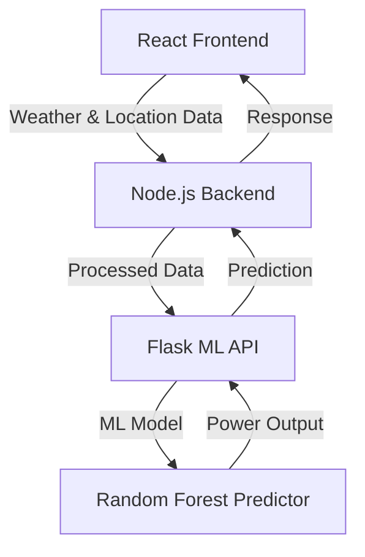

# 🌞 Solar Power Prediction System

An **AI-powered Solar Power Output Prediction System** that leverages machine learning to predict real-time solar power generation (kW) using weather and location data through a sophisticated Random Forest model.

<details>
<summary>📋 Table of Contents</summary>

- [Features](#-features)
- [Architecture](#️-architecture)
- [Tech Stack](#-tech-stack)
- [Project Structure](#-project-structure)
- [Installation Guide](#-installation-guide)
- [API Documentation](#-api-documentation)
- [Development Team](#-development-team)
- [Contributing](#-contributing)
</details>

## ⚡ Features

<details>
<summary>Click to expand features</summary>

- 🤖 **Advanced ML Integration**
  - Trained Random Forest model for precise solar output forecasting
  - Real-time predictions based on current weather conditions
  - Automated data preprocessing and scaling

- 🔗 **Robust Architecture**
  - Full-Stack Integration: React → Node.js → Python
  - RESTful API design with proper error handling
  - Scalable microservices architecture

- � **Technical Features**
  - Flask ML API serving model predictions
  - Auto-scaling data normalization
  - CORS-enabled API communication
  - Real-time weather data integration
  - Secure environment configuration
</details>

## 🏗️ Architecture

<details>
<summary>View System Architecture</summary>



- **Frontend Layer**: React.js with Vite
- **Backend Layer**: Node.js with Express
- **ML Layer**: Flask API with scikit-learn
</details>

## 💻 Tech Stack

<details>
<summary>View Technology Details</summary>

- **Frontend**
  - React.js 18+
  - Vite
  - CSS Modules
  - OpenWeatherMap API

- **Machine Learning and Backend**
  - Python 3.x
  - Flask
  - scikit-learn
  - pandas
  - numpy
</details>

## 📂 Project Structure

<details>
<summary>Explore Project Structure</summary>

```
SolarPower-ML/
├── Front-end/                 # React.js UI
│   ├── src/
│   │   ├── Components/       # React components
│   │   ├── assets/          # Static assets
│   │   └── App.jsx          # Main app component
│   ├── index.html
│   └── package.json
|
└── ModelTrain-ML/            # Python ML model + Flask API
    ├── train_model.py       # Model training script
    ├── app.py              # Flask API server with email integration
    ├── index.py            # Flask API server without email integration
    ├── requirements.txt    # Python dependencies
    ├── models/            # Saved model files
    └── data/             # Training data
```
</details>

## 🚀 Installation Guide

<details>
<summary>1️⃣ Flask ML Server Setup</summary>

```bash
# Navigate to ML directory
cd ModelTrain-ML

# Create and activate virtual environment
python3 -m venv venv
source venv/bin/activate     # Windows: venv\Scripts\activate

# Install dependencies
pip install -r requirements.txt

# Train model and start server
python train_model.py        # Generate model files
python app.py               # If required email integration
python index.py               # If don't required email integration
```
</details>


<details>
<summary>3️⃣ React Frontend Setup</summary>

```bash
# Navigate to frontend directory
cd Front-end

# Install dependencies
npm install

# Configure environment
cp .env.example .env
# Add your OpenWeatherMap API key

# Start development server
npm run dev                  # Runs at http://localhost:5173
```
</details>

## 📡 API Documentation

<details>
<summary>View API Endpoints</summary>

### Predict Solar Power Output

```http
POST /api/predict/solarpower
Content-Type: application/json

{
  "IsDaylight": 1,
  "Average_Temperature": 29.8,
  "Average_Wind_Direction": 5,
  "Average_Wind_Speed": 4.2,
  "Sky_Cover": 2,
  "Visibility": 8,
  "Relative_Humidity": 65,
  "Average_Barometric_Pressure": 29.6,
  "Month": 10,
  "Day": 15
}
```

## 👨‍💻 Development Team

<details>
<summary>Meet the Team</summary>

| Name | Role | Contributions |
|------|------|--------------|
| Het Limbani | Lead Developer | 🌞 Solar Power ML Integration, MERN Stack Development |
| Anuj Raval | ML Engineer | 🤖 Machine Learning Model Development, Python Backend |
</details>

## 🤝 Contributing

<details>
<summary>How to Contribute</summary>

1. Fork the repository
2. Create a feature branch (`git checkout -b feature/AmazingFeature`)
3. Commit changes (`git commit -m 'Add AmazingFeature'`)
4. Push to branch (`git push origin feature/AmazingFeature`)
5. Open a Pull Request

Please read our [Contributing Guidelines](CONTRIBUTING.md) for details.
</details>

## 📝 Important Notes

<details>
<summary>View Important Notes</summary>

1. Ensure all three servers are running simultaneously
2. Maintain consistent ports (5173 → 3011 → 5000)
3. Configure CORS settings appropriately
4. Keep environment variables secure
5. Regular model retraining recommended
</details>
